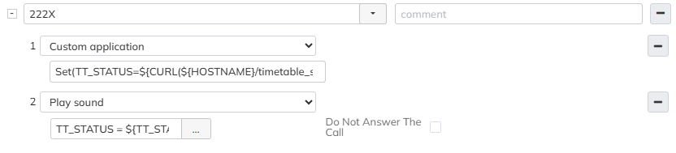

# Timetable Status integration mit Wildix WMS

### Summary
This integration makes it possible to query the status of a Wildix WMS timetable and returns `1` (active) or `0` (inactive).

The result depends on the timetable state:
- **Force active** → always returns `1`
- **Force inactive** → always returns `0`
- **Check time** → returns `1` if the current date and time falls within one of the defined ranges, `0` otherwise

### Dev Log
- 26.06.2025 - First release

### Install

From WMS console, logged as root.

>apt-get update && apt-get install git -y && cd /var/www/ && git clone https://github.com/Netkum-AG/timetable_status.git && cd timetable_status && chmod +x main.py

### Configuration

Define the following variables in **Dialplan > General Settings > Dialplan Variables**:
- HOSTNAME=https://xxxx.wildixin.com
- WMS_APP_TOKEN=Simple token generated from **PBX > Integrations > Applications**

### API call

The endpoint accepts the following GET parameters:

| Parameter | Description |
|---|---|
| `wms_hostname` | Full URL of the WMS host (e.g. `https://xxxx.wildixin.com`) |
| `wms_app_token` | Bearer token from PBX > Integrations > Applications |
| `time_table_id` | ID of the timetable to evaluate |

Returns `1` if active, `0` if inactive.

### Dialplan change

The `time_table_id` is passed dynamically in the dialplan. Add a custom application to store the timetable status in a variable, replacing `<id>` with the actual timetable ID:

```
Set(TT_STATUS=${CURL(${HOSTNAME}/timetable_status/timetable.php?wms_hostname=${HOSTNAME}&wms_app_token=${WMS_APP_TOKEN}&time_table_id=<id>)})
```

Then use a condition on `${TT_STATUS}` to branch the dialplan accordingly.

Debug script for dialplan to be used as custom application:

```
noop(${CURL(${HOSTNAME}/timetable_status/timetable.php?wms_hostname=${HOSTNAME}&wms_app_token=${WMS_APP_TOKEN}&time_table_id=<id>)})
```

### Dialplan test example

Call 2228 to get the status from timetable with id 8.



### Update

From WMS console, logged as root.

>cd /var/www/timetable_status && git reset --hard && git pull && chmod +x main.py

### Bug report & support
Please open an issue on GitHub with as many details as possible and screenshot from the problem.  
https://app.x-bees.com/kite/pierre.anken@netkum.ch
